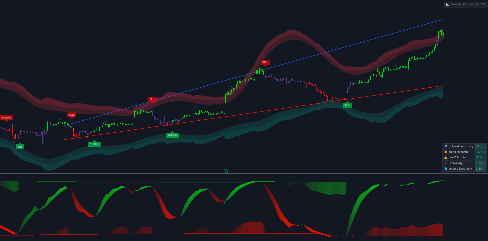
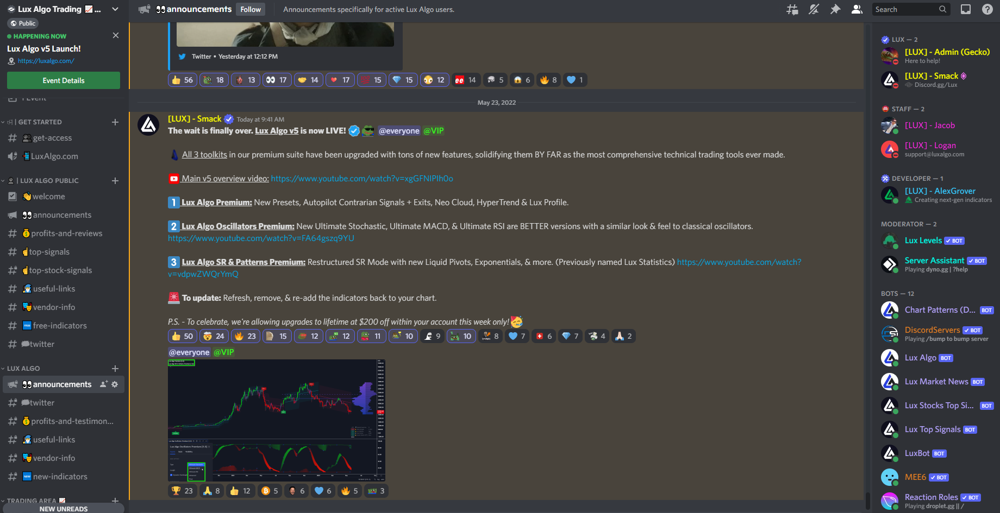

# What Is ChartFi?

ChartFi is a company creating feedback oriented indicators designed to give traders next-generation visualizations of every market. The ChartFi Premium suite on TradingView consists of 3 indicators which all are considered "all-in-one" toolkits with dozens of unique features for traders to use in their technical analysis.

ChartFi also hosts a full user experience within Discord, where users can receive thousands of alerts across every market, optimize their indicator settings with optimizer bots, and interact with a 50,000+ member community of traders.

The tools we build aim to give the user unique perspectives & provide a comprehensive trading arsenal.

Whether it's the signals, candle coloring, dashboard data, automated alerts, settings optimizer bots, support & resistance, institutional activity, or a mixture of these together; users typically switch between a few features from our toolkits and incorporate it in their trading.

This is within one all-inclusive membership you can sign up for on our website.

## Why choose ChartFi?
We are notorious for our transparency and expertise; having a huge following for a collection of 42+ open-source indicators released freely on the TradingView platform. Our free & paid indicators are used by hundreds of thousands of traders & investors around the world.

Alexgrover, our Lead Developer, is one of the only 18 hand picked Pine Wizards selected by TradingView for their outstanding development on the platform. Our work has received numerous Editors' Picks by TradingView and fundamentally has changed the way traders analyze markets.

## Why It Can Work
Traders typically have several questions after seeing ChartFi, one of them being:

What advantages do these paid indicators give me over free ones?

And the most important one:

Will I make profits using them?

It would be presumptuous and dishonest on our part to tell you the indicators we provide work like a charm and will guarantee you huge returns in a short amount of time, things are more complicated than that.

No indicator is capable of guaranteeing any improvement to your performance, nor is any strategy capable of maintaining a percentage accuracy over time; money printers do not exist. Our indicators are designed to be fully user interactive and have a high level of interoperability with each other, and this is actually what can make them work for you.

## The User And The Indicator
A trader may expect indicators to work by themselves without requiring any user interaction; just set them running and forget them. "If an indicator can't generate returns under these conditions then it isn't worth using."

The worth of a technical indicator will hardly be found in its ability to make you money by itself, the complexity of market prices variations makes this way too difficult, and a technical indicator is not smart nor adaptable enough to overcome such extreme conditions, however, this is not the case of the experienced trader, who will not use the indicator as a money printer, but as a supportive tool for decision making.

We believe that the success lies in the association of the user with the indicator. The indicator can access and process a large amount of data, delivering a large quantity of useful and easy to interpret information which the trader can't really do by themselves, but he/she is smart, aware of a lot of external factors, and can manage their money.

When I was passing tests to work at a private investment fund, we needed to work alongside an automated trading algorithm, I thought that we just had to let it run, but no, we had to stop the algorithm during huge volatile markets movements, limiting risk, so we had to team up with the algorithm to make it work, this changed my vision on technical indicators and their usability in trading.

— alexgrover

An indicator giving non-redundant information that is easy to access and of high quality alongside an experienced trader will form a strong pairing; this is exactly what ChartFi provides.

## Embracing Your Trading Style
If you are not free you won't go far, some traders are natural contrarians, others ride with the trend, whatever your trading style is we embrace it - giving you indicators that any kind of trader can use to their full potential.

This is part of the success of the ChartFi Premium indicators with traders; while a lot of indicators give you a two-dimensional picture of the market, we give you a three-dimensional picture, giving you the liberty to trade the indicators the way you want, as a standalone or in confluence with other indicators.