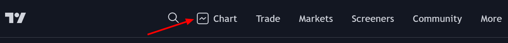
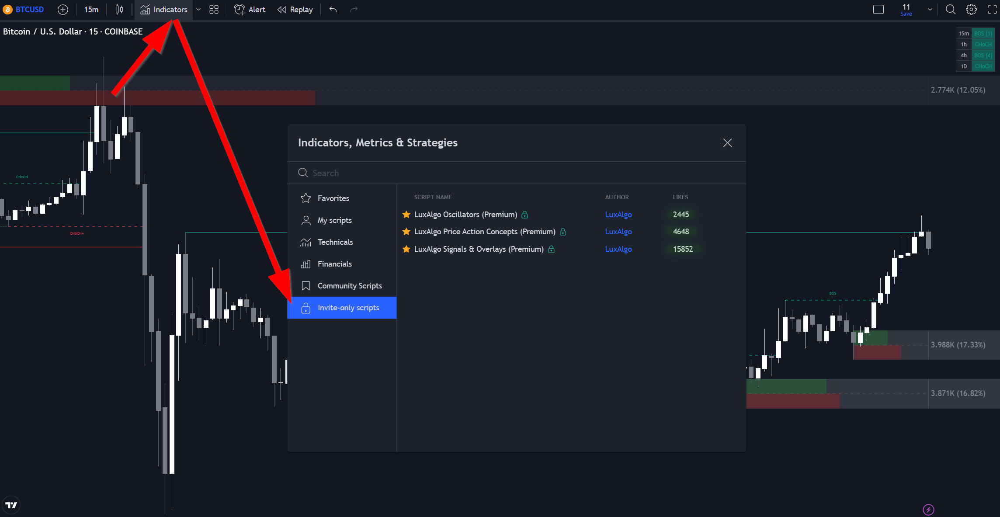
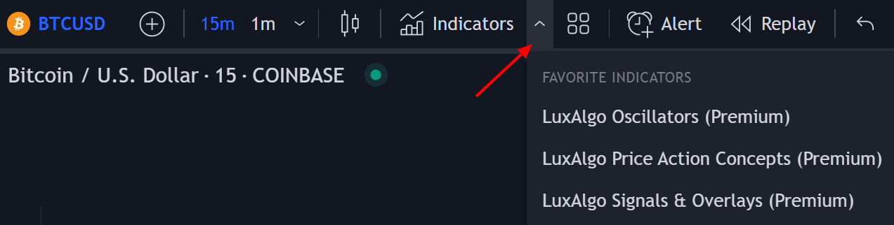

# Setup ChartFi on TradingView
Once you've signed up on our website and entered your active TradingView username within the "Connect Accounts" portal from your email, you will have instant access to use our indicators on the platform.

In order to use the indicators, you need to open a chart on TradingView.

Once open, click on Indicators (or type / ) to open the indicator menu, then click on "invite-only scripts", you should see the indicators names appearing, click on one of them to add it to your chart.

:::info Info

If you don't see the invite-only scripts folder or the ChartFi Premium indicators, try refreshing your browser/app. If this still doesn't have them show up, please email support@ChartFi.com with your TradingView username & our team will grant you access manually within 6 hours.

:::

If you need to quickly access the indicators you can add them to your favorites by clicking on the star at the left of the indicators names, you will then be able to load the starred indicators directly from your favorites.

