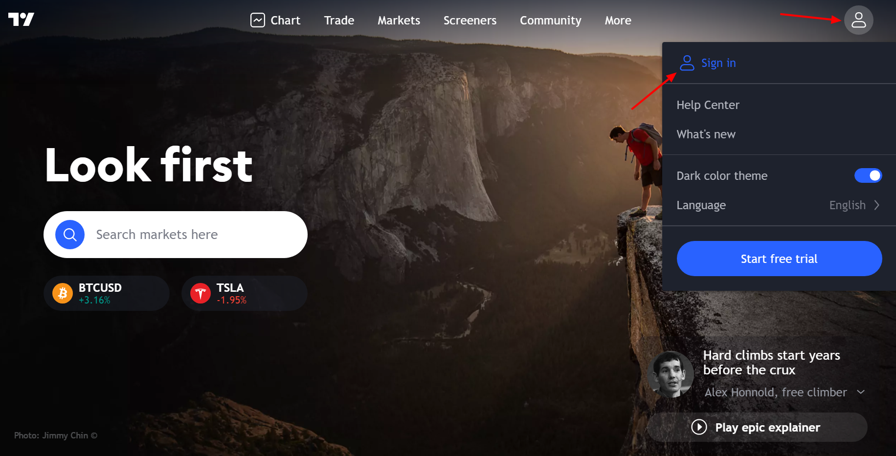
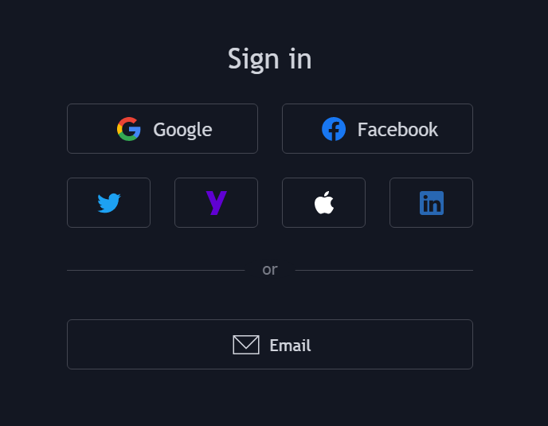
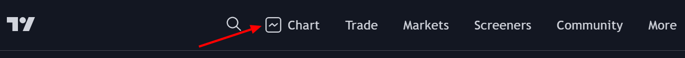
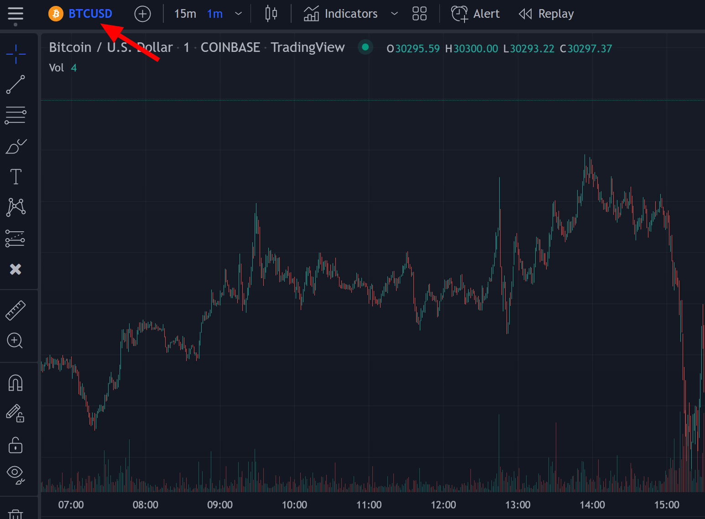

# What Is TradingView?

TradingView is a free charting platform and social network where traders/investors can look at financial charts and use a wide variety of tools to spot opportunity in every market across Stocks, Forex, Crypto, Futures & Commodities. TradingView users can connect most brokers to trade directly on the platform and leap into opportunities as they are presented in real time from their charts.

:::info Info

This is the great platform where we host our ChartFi Premium indicator suite. You can create a free account on TradingView and then after signing up on our website receive instant-access to use our products from your indicators folder.

:::

## How To Create A TradingView Account
In order to create a TradingView account, you need to go to the TradingView homepage. Click on "Sign in" at the top right of the homepage, then click on "Sign up" at the bottom of the current window. You can sign up using your social media profiles or an email address.

## TradingView Charts
### How To Open A Chart On TradingView

You can open a chart on TradingView by clicking on 'Chart', located at the top left of the website when you are logged in.

## How To Change Symbol

